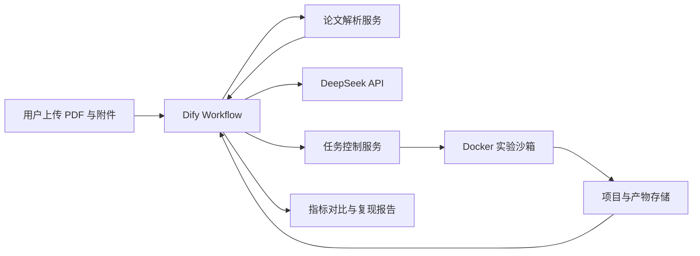

# Dify 通用计算型论文复现 Agent 设计

日期：2026-08-02
状态：已确认，待实施计划

## 1. 目标

在一台 Windows 11 个人电脑上部署自托管 Dify，接入可替换的大模型 API，首个供应商为 DeepSeek。用户上传论文 PDF，并可选提供作者代码、数据、补充材料、仓库链接和目标指标。系统自动完成论文多模态解析、复现条件抽取、实验规划、Python 代码与环境生成、Docker 沙箱执行、论文指标对比和复现报告生成。

首版面向可通过软件执行的计算型论文，包括数据分析、机器学习、深度学习、GIS 中可由 Python 完成的部分和软件仿真。默认成功目标是“指标复现”：程序运行成功只是必要条件，主要指标还需落入允许误差范围。

## 2. 用户与部署约束

- 使用者：单用户。
- 访问范围：仅本机，不提供公网服务。
- 主机：Windows 11、AMD Ryzen 7 7735H、16 GB 内存、NVIDIA RTX 4060。
- Dify：Community Edition，自托管于 Docker Desktop/WSL2。
- 大模型：云端 API，首个供应商为 DeepSeek，业务流程不绑定具体模型名称。
- 并发：首版最多运行一个实验任务。
- 自主权限：沙箱内操作自动执行；涉及付费资源、许可证不明的材料、宿主机访问、外部发布或资源超限时暂停确认。

## 3. 范围

### 3.1 首版包含

- PDF、代码、数据、补充材料和链接输入。
- 文本、扫描页、表格、公式、图表、页面布局和图片解析。
- 带页码和原文证据的结构化论文档案。
- 材料完整性和可复现性评估。
- 可执行实验计划生成和人工确认。
- Python 项目、依赖文件与 Docker 环境生成。
- 冒烟实验、正式实验、有限自动修复和日志采集。
- 论文指标与复现指标比较。
- Markdown 报告、结构化 JSON 和产物索引。
- 异步任务状态、取消、超时、检查点和重启恢复。

### 3.2 首版不包含

- 自动控制 ArcGIS Desktop 或其他 Windows 图形界面软件。
- 默认执行 MATLAB 等需要额外许可证的环境。
- 多用户、任务并发或公网访问。
- 自动购买数据、API 额度或算力。
- 无限制自动调参或无限错误重试。
- 自动将论文模型发布为公网 API。
- 对材料不完整或算力不足的论文承诺指标一定能够复现。

## 4. 设计原则

1. **证据优先**：关键抽取结果必须带论文页码和原文依据。
2. **不确定性显式化**：无法可靠识别的内容标记为不确定，禁止模型自行补全。
3. **确定性编排**：关键阶段由 Dify Workflow 固定编排，不依赖模型自由选择全部步骤。
4. **职责隔离**：Dify 负责编排，解析服务负责文档，任务服务负责执行，实验容器负责代码。
5. **最小权限**：实验只访问当前项目目录和获准的网络资源。
6. **先小后大**：先运行小数据、少轮次冒烟实验，再进入正式实验。
7. **全程可追溯**：输入、提示、模型、配置、代码版本、日志、指标和修复记录均落盘。
8. **停止条件明确**：修复次数、诊断实验数、时间、内存、显存和磁盘均设置上限。

## 5. 总体架构



### 5.1 Dify

提供本地用户界面、文件入口、阶段编排、模型调用、人工确认、任务查询和报告展示。首版使用 Workflow/Chatflow 和 HTTP 请求节点，不开发自定义 Agent Strategy。

### 5.2 论文解析服务

接收论文与附件，识别 PDF 类型，提取正文、章节、表格、公式、图像、图注、参考文献、页码和页面坐标。Docling 为主解析器；复杂中文扫描页、表格、公式或图表使用 PaddleOCR PP-StructureV3 按页回退。

### 5.3 DeepSeek

负责论文内容理解、结构化抽取、实验规划、代码生成、错误诊断、修复建议和报告写作。所有关键输出必须通过 JSON Schema 校验，模型标识由 Dify 配置提供。

### 5.4 任务控制服务

使用 FastAPI 提供窄接口，持久化任务状态，创建与限制实验容器，管理超时、取消、重试、检查点、日志和产物。它是唯一可以管理实验容器的组件；Dify 容器不取得 Docker 管理权限。

### 5.5 Docker 实验沙箱

按论文创建独立容器，执行依赖安装、数据处理、训练和评估。容器非特权运行，只挂载当前论文项目目录；实验阶段默认关闭网络。需要 GPU 时显式申请 RTX 4060。

### 5.6 存储

每篇论文拥有独立本地项目目录。首版任务元数据使用 SQLite；原始文件、解析结果、代码、日志、指标、模型和报告使用文件系统保存。迁移到多用户服务器后可替换为 PostgreSQL 和对象存储。

## 6. 单篇论文的数据流

1. 用户上传 PDF，选择性提供代码、数据、补充材料、链接和目标指标。
2. 系统执行文件检查、恶意内容与来源提示、PDF 类型检测和多模态解析。
3. DeepSeek 将解析结果转换为带证据的结构化论文档案。
4. 系统评估数据、代码、参数、框架、指标、依赖和算力是否足够。
5. 材料不足时列出缺失项；用户可补充材料或允许系统寻找公开来源。
6. 材料足够时生成环境、数据、模型、训练、评估和产物计划。
7. 计划通过规则检查和必要的人工确认后，任务服务创建项目与实验环境。
8. 先执行冒烟实验。失败时诊断并有限修复；通过后运行正式实验。
9. 从实验产物中提取指标，与论文验证目标比较。
10. 指标未达标时进行有限诊断实验；达到停止条件后生成最终结论。
11. 输出复现报告、代码、环境、日志、模型、图表和产物索引。

## 7. 论文解析与论文档案

### 7.1 解析流水线

1. 检测文本型、扫描型或混合型 PDF。
2. 识别标题、章节、双栏、页眉页脚、脚注和参考文献。
3. 提取正文、表格、公式、图像、图注和坐标。
4. 对无文本层、乱码或低置信度页面执行 OCR 回退。
5. 合并跨页段落、表格和参考文献。
6. 按章节和语义分块，保留页面与元素映射。
7. 提取复现所需结构化字段。
8. 校验关键字段是否存在证据引用。

### 7.2 核心数据结构

论文档案至少包含：

- 标题、研究问题、任务类型和声明贡献；
- 数据集、数据划分、预处理和增强方法；
- 模型、算法、超参数、训练过程和随机种子；
- 软件、硬件和依赖环境；
- 评价指标、评价公式和论文结果；
- 表格、图像、公式、代码仓库和数据链接；
- 缺失信息、不确定信息和冲突信息；
- 每个关键字段对应的页码、原文和页面元素标识。

任何无法从论文或用户附件中验证的内容必须标记来源为 `inferred` 或状态为 `uncertain`，不得伪装成论文事实。

## 8. 项目结构与代码生成

```text
paper-project/
├─ inputs/                 # 原始论文与用户附件
├─ paper/                  # 结构化论文档案、表格、公式和图片
├─ plan/                   # 复现计划与实验配置
├─ src/                    # 数据处理、模型、训练和评估代码
├─ configs/                # 参数、随机种子和数据路径
├─ tests/                  # 最小验证测试
├─ outputs/                # 指标、图表、模型和中间结果
├─ logs/                   # 安装、执行、错误和修复记录
├─ Dockerfile
├─ requirements.lock
└─ reproduction-report.md
```

优先使用作者代码；没有代码时才生成最小可运行实现。生成或修改代码前先形成变更说明。每次修改保存为独立版本，并记录修改原因、关联错误和指标变化。

首版识别多种论文软件生态，但只保证 Python 任务自动执行。R、Java、MATLAB 和专有 GIS 工具只有配置了对应镜像、运行时和许可证后才进入执行阶段。

## 9. 执行安全与资源控制

- 同时最多一个实验任务。
- 容器以非特权用户运行。
- 只挂载当前论文项目目录，不挂载其他用户目录、Docker 管理接口或系统敏感目录。
- 依赖安装阶段可按白名单访问网络；实验阶段默认禁网。
- CPU、内存、GPU、运行时间、磁盘和日志大小均有硬限制。
- 未经确认不执行来源不明脚本，不下载许可证不清楚的数据，不使用付费服务。
- 预计资源超过阈值时，任务进入 `waiting_approval`，并展示估算值和原因。
- 同一阶段默认最多自动修复三次；指标诊断实验也设置独立上限。
- 禁止为了接近论文结果而修改评价公式、隐藏失败实验或篡改数据划分。

## 10. 指标验证

每个验证目标包括：指标名称、论文报告值、数据集、数据划分、实验配置、指标方向、证据位置、允许误差、复现值、差异和判定结果。

默认规则：

- 百分比型指标：允许绝对误差 ±1 个百分点。
- 连续数值指标：允许相对误差 ±5%。
- 论文报告均值与方差时，优先判断复现结果是否落在合理统计区间。
- 用户可针对具体指标覆盖默认阈值。
- 数据划分或评价公式无法确认时，不得给出“成功复现”。

最终结论只有四种：

1. 成功复现：主要指标均达到允许误差。
2. 部分复现：流程可运行，只有部分主要指标达标。
3. 运行成功但未复现：得到有效结果，但与论文差异明显。
4. 无法复现：缺少关键材料、依赖、许可证或算力。

## 11. 异步任务与接口

Dify 创建任务后立即获得 `task_id`，不持续占用工作流等待长实验。任务控制服务至少提供以下逻辑操作：

- 创建任务；
- 查询状态、阶段和进度；
- 查看阶段日志与错误摘要；
- 提交人工确认结果；
- 取消任务；
- 从最近检查点继续；
- 获取报告和产物清单。

任务状态包括：`created`、`parsing`、`waiting_approval`、`planning`、`building`、`running`、`validating`、`completed`、`partial`、`failed`、`cancelled`。所有状态变更持久化并附带时间、原因和触发者。

## 12. 异常处理与恢复

- PDF 解析失败：切换逐页 OCR；仍失败时报告具体页码。
- 模型结构化输出失败：执行 Schema 校验和有限重新生成。
- 依赖安装失败：尝试兼容版本或替代镜像，并记录与论文环境的差异。
- 代码运行失败：保存完整日志，最多自动修复三次。
- 资源不足：保存检查点并报告预计资源，不自动扩大权限。
- API 超时或限额：指数退避重试；达到上限后等待用户处理。
- 指标未达标：优先检查数据划分、预处理、随机种子、依赖和参数，进行有限诊断实验。
- 服务或电脑重启：从持久化状态恢复查询；可从最近安全检查点继续。

完整日志留在项目目录，Dify 只显示阶段进度、摘要和关键错误，避免把大量日志放入模型上下文。

## 13. 技术选型

| 模块 | 首版实现 |
|---|---|
| 基础环境 | Windows 11、WSL2、Docker Desktop |
| 编排与界面 | Dify Community Edition |
| 模型接入 | Dify DeepSeek 模型插件，预留其他供应商 |
| 工作流 | Dify Workflow/Chatflow |
| 服务接口 | Python FastAPI |
| 主 PDF 解析 | Docling |
| OCR/复杂页面回退 | PaddleOCR PP-StructureV3 |
| 数据契约 | JSON Schema、Pydantic |
| 任务元数据 | SQLite |
| 实验执行 | 独立 Docker 容器 |
| 产物 | 本地文件系统，Markdown 与 JSON 报告 |

Dify 通过 HTTP 请求节点调用解析与任务服务。第二阶段可以把稳定接口封装为 Dify Tool 插件，但不改变服务契约。

## 14. 测试设计

建立至少三类固定样本：文本型机器学习论文、中文扫描或混合型论文、公式和图表密集型论文。当前奉节县滑坡论文作为 GIS/机器学习综合样本，只执行能够在 Python/Docker 内完成的部分。

测试层级：

1. 解析测试：阅读顺序、表格、公式、图片和页码引用。
2. Schema 测试：论文档案与实验计划严格校验，缺失项显式表达。
3. 计划测试：数据、模型、指标和参数可追溯到证据。
4. 执行与安全测试：资源限制、目录隔离、网络策略和取消有效。
5. 恢复测试：Dify、任务服务或电脑重启后状态与产物不丢失。
6. 端到端测试：上传、解析、规划、执行、验证和报告完整闭环。

首版验收条件：

- 三类测试 PDF 均生成结构化论文档案。
- 所有关键提取项带页码依据。
- 至少两篇具有公开代码和小型数据集的论文完成端到端运行。
- 至少一篇论文的主要指标达到预设误差。
- 错误任务可恢复、取消并查看完整日志。
- 未经确认不能访问当前项目目录以外的宿主机文件。
- 同一输入与配置可以再次产生可比较的结果。
- 失败任务不得产生虚假的“复现成功”结论。

## 15. 实施里程碑

### M0：基础环境

部署 WSL2、Docker Desktop 和 Dify，安装 DeepSeek 插件，配置 API Key、目录与资源限制。验收为 Dify 本机可访问并成功调用 DeepSeek。

### M1：论文解析闭环

实现文件入口、FastAPI 解析服务、Docling 主解析、PP-StructureV3 页面回退、论文档案生成和 Dify 展示。验收为测试 PDF 能生成带证据的结构化复现清单。

### M2：复现规划闭环

定义论文档案与实验计划 Schema，实现 DeepSeek 规划、证据检查、规则校验和人工确认。验收为论文档案稳定转换为可审查的执行计划。

### M3：Docker 执行闭环

实现异步任务服务、受限容器、项目生成、冒烟实验、正式实验、状态查询、取消、日志、检查点与有限自动修复。验收为至少两篇小型公开论文从 PDF 进入实际运行。

### M4：指标与报告闭环

实现验证目标、指标提取、误差判定、结论生成、Markdown 报告、JSON 和产物索引。验收为至少一篇论文达到主要指标允许误差并形成端到端 MVP。

## 16. 后续演进

MVP 稳定后，按实际需求选择增加：Windows/ArcGIS Worker、R/Java/MATLAB 镜像、视觉模型供应商、多模型路由、服务器迁移、多用户与任务队列、Dify Tool 插件、对象存储和更严格的供应链安全扫描。
